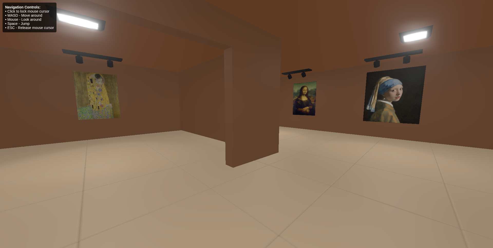

# 3D Art Gallery (Three.js)

A fully interactive, WebGL-powered 3D art gallery built with [Three.js](https://threejs.org/). Explore an immersive environment with first-person navigation, dynamic lighting, postprocessing effects, and interactive art detail popups.



---

## Features

- Loads a fully modeled `.glb` 3D environment (`/gal.glb`)
- First-person movement (WASD, mouse look, jump)
- Dynamic lights with bloom (spotlights, ceiling lights)
- Art detection and hover interaction via raycasting
- Popups for detailed artwork information
- Collision handling, gravity, and ground detection
- Fetches metadata from `art_details.json`
- Pointer lock support for immersive experience

---

## Getting Started

### 1. Clone the Repository

```bash
git clone https://github.com/sammanbajracharya/art-gallery.git
cd art-gallery
```

### 2. Install & Run
```bash
npm install
npm run dev
```

### 3. File Structure
```
.
├── bun.lock
├── index.html
├── package.json
├── package-lock.json
├── public
│   ├── 3d-art-gallery.glb
│   ├── art_details.json
│   ├── gal.glb
│   ├── images
│   │   ├── monalisa.webp
│   │   ├── pearlearring.jpg
│   │   ├── preview.png
│   │   ├── starrynight.jpg
│   │   ├── thekiss.jpg
│   │   ├── theswing.jpeg
│   │   ├── waveoffkanagawa.jpg
│   │   └── wheatfield.jpg
│   └── svg
│       └── cross.svg
├── readme.md
├── src
│   ├── controller
│   │   └── navigation-controller.js
│   ├── core
│   │   ├── camera.js
│   │   ├── lighting.js
│   │   ├── renderer.js
│   │   └── scene.js
│   ├── main.js
│   ├── objects
│   │   └── room.js
│   └── style.css
└── vite.config.js

8 directories, 26 files
```

### Controls
| Action            | Input                      |
| ----------------- | -------------------------- |
| Move              | `W`, `A`, `S`, `D`         |
| Look around       | Mouse drag (click to lock) |
| Jump              | `Space`                    |
| Interact with art | `E` while hovering         |
| Close popup       | `Escape` or click outside  |

### Art Interaction
* Art pieces must be named with prefix art_piece in the 3D model.
* Hovering displays a prompt.
* Pressing E shows detailed metadata from art_details.json.

#### Example art_details.json Entry
```
{
  "art_piece_001": {
    "title": "Starry Night",
    "artist": "Vincent van Gogh",
    "date": "1889",
    "description": "A famous post-impressionist painting.",
    "image": "public/images/starry-night.jpg",
    "links": [
      "https://en.wikipedia.org/wiki/The_Starry_Night"
    ]
  }
}
```

### Lighting System
Lights are added dynamically based on object name prefixes:

| Prefix               | Light Type              |
| -------------------- | ----------------------- |
| `glow_light_spot`    | `SpotLight`             |
| `glow_light_ceiling` | `RectAreaLight`         |

Each light is positioned using the object's world position and emits soft shadows.

### Navigation Controller
The NavigationController (in /controller/navigation-controller.js) handles:
- Pointer lock
- Camera pitch/yaw from mouse movement
- Movement (WASD)
- Jumping and falling with gravity
- Collision with walls using bounding spheres
- Ground detection using raycasting
- Auto-unstuck feature

### Postprocessing Effects
Powered by EffectComposer:
- RenderPass: Basic render
- UnrealBloomPass: Glows on emissive objects
- OutputPass: Final display pass
